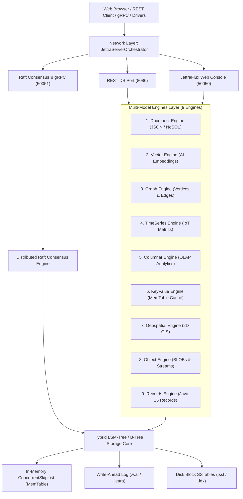
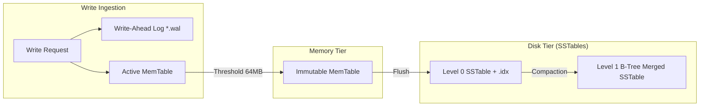
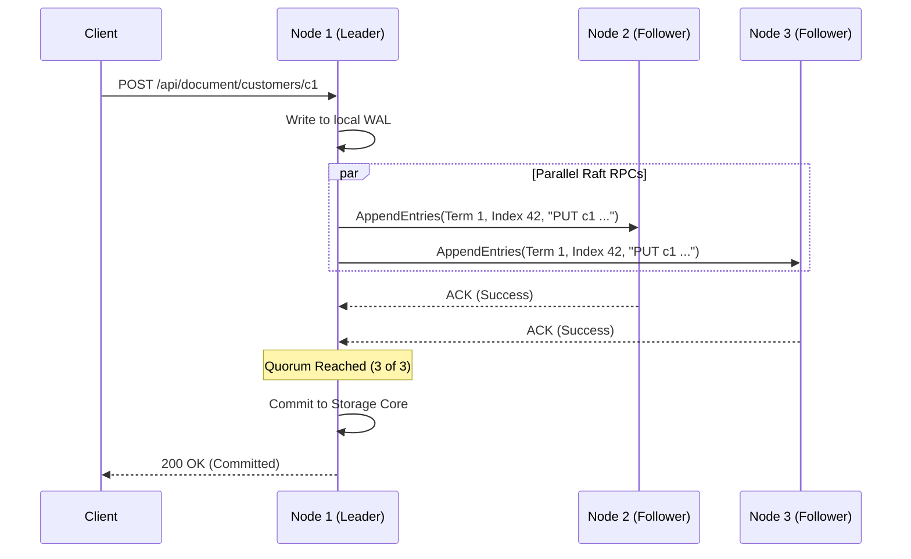

# JettraStoreEngine: The Definitive Architecture, Development & Operations Book
**Autonomous Multi-Model Storage Engine with Raft Consensus, LSM-Tree / B-Tree Hybrid Storage, and High-Density Java 25 Virtual Architecture**

---

## Table of Contents

- [Chapter 1: Introduction, Architecture & JVM 25 Optimizations](#chapter-1-introduction-architecture--jvm-25-optimizations)
  - [1.1 Autonomous & Zero-Dependency Design](#11-autonomous--zero-dependency-design)
  - [1.2 Java 25 Native Features: Virtual Threads & Compact Object Headers](#12-java-25-native-features-virtual-threads--compact-object-headers)
  - [1.3 Hybrid LSM-Tree + B-Tree Storage Architecture](#13-hybrid-lsm-tree--b-tree-storage-architecture)
  - [1.4 Document Versioning & MVCC Change History](#14-document-versioning--mvcc-change-history)
- [Chapter 2: Storage Engine Internals, Algorithms & Compaction](#chapter-2-storage-engine-internals-algorithms--compaction)
  - [2.1 The Write Pipeline (WAL & In-Memory MemTable)](#21-the-write-pipeline-wal--in-memory-memtable)
  - [2.2 The Read Pipeline (Bloom Filters & Sparse B-Tree Index)](#22-the-read-pipeline-bloom-filters--sparse-b-tree-index)
  - [2.3 LSM Compaction Service & Tombstone Sweeping](#23-lsm-compaction-service--tombstone-sweeping)
  - [2.4 Placement Driver (PD) & Multi-Raft Groups](#24-placement-driver-pd--multi-raft-groups)
- [Chapter 3: Installation, Configuration & Property Reference](#chapter-3-installation-configuration--property-reference)
  - [3.1 Prerequisites & Source Compilation](#31-prerequisites--source-compilation)
  - [3.2 The `jettrastoreengine.properties` Reference Guide](#32-the-jettrastoreengineproperties-reference-guide)
  - [3.3 Shell Console Startup Banner](#33-shell-console-startup-banner)
- [Chapter 4: Multi-Node Clustering & Distributed Raft Consensus](#chapter-4-multi-node-clustering--distributed-raft-consensus)
  - [4.1 Distributed Raft Protocol & Quorum Replication](#41-distributed-raft-protocol--quorum-replication)
  - [4.2 Local Multi-Node Cluster Execution from JAR Files](#42-local-multi-node-cluster-execution-from-jar-files)
  - [4.3 Multi-Server Remote Cluster Deployment](#43-multi-server-remote-cluster-deployment)
- [Chapter 5: Docker & Docker Compose Multi-Node Orchestration](#chapter-5-docker--docker-compose-multi-node-orchestration)
  - [5.1 High-Density `Dockerfile` (Liberica JRE 25 Musl)](#51-high-density-dockerfile-liberica-jre-25-musl)
  - [5.2 Production 3-Node `docker-compose.yml`](#52-production-3-node-docker-composeyml)
  - [5.3 Container Lifecycle & Operational Commands](#53-container-lifecycle--operational-commands)
- [Chapter 6: The 9 Multi-Model Database Engines & Exhaustive APIs](#chapter-6-the-9-multi-model-database-engines--exhaustive-apis)
  - [6.1 Document Engine (JSON / BSON / NoSQL)](#61-document-engine-json--bson--nosql)
  - [6.2 Vector Engine (AI Embeddings, Cosine Similarity & ANN)](#62-vector-engine-ai-embeddings-cosine-similarity--ann)
  - [6.3 Graph Engine (Vertices, Edges & Deep Traversal)](#63-graph-engine-vertices-edges--deep-traversal)
  - [6.4 TimeSeries Engine (IoT Telemetry, Metrics & Range Aggregations)](#64-timeseries-engine-iot-telemetry-metrics--range-aggregations)
  - [6.5 Columnar Engine (OLAP, Analytical Projections & Run-Length Encoding)](#65-columnar-engine-olap-analytical-projections--run-length-encoding)
  - [6.6 KeyValue Engine (MemTable Cache & Atomic Counters)](#66-keyvalue-engine-memtable-cache--atomic-counters)
  - [6.7 Geospatial Engine (2D Coordinates, GIS Layers & Haversine Distance)](#67-geospatial-engine-2d-coordinates-gis-layers--haversine-distance)
  - [6.8 Object Engine (Binary BLOBs, Chunked Blocks & Media Streams)](#68-object-engine-binary-blobs-chunked-blocks--media-streams)
  - [6.9 Records Engine (Java 25 Records, Component Validation & Schema Reflection)](#69-records-engine-java-25-records-component-validation--schema-reflection)
- [Chapter 7: Aggregations Pipeline & Real-Time Analytics](#chapter-7-aggregations-pipeline--real-time-analytics)
  - [7.1 Pipeline Stages & Accumulator Operators](#71-pipeline-stages--accumulator-operators)
  - [7.2 Aggregations via Java Driver & High-Level Methods](#72-aggregations-via-java-driver--high-level-methods)
  - [7.3 Aggregations via Jettra Shell & REST API](#73-aggregations-via-jettra-shell--rest-api)
- [Chapter 8: Polyglot Drivers: Java, Python, Go & Multi-Model Transactions](#chapter-8-polyglot-drivers-java-python-go--multi-model-transactions)
  - [8.1 Java Driver: Typed Repository Pattern & Fluent Query API](#81-java-driver-typed-repository-pattern--fluent-query-api)
  - [8.2 Multi-Model ACID Transactions in Java](#82-multi-model-acid-transactions-in-java)
  - [8.3 Python Driver (`jettra-driver`)](#83-python-driver-jettra-driver)
  - [8.4 Go Driver (`github.com/jettra/jettra-driver-go`)](#84-go-driver-githubcomjettrajettra-driver-go)
- [Chapter 9: End-to-End Enterprise Domain: Multi-Model E-Invoicing System](#chapter-9-end-to-end-enterprise-domain-multi-model-e-invoicing-system)
  - [9.1 Domain Entity Definitions with Immutable Java Records](#91-domain-entity-definitions-with-immutable-java-records)
  - [9.2 Polyglot Multi-Engine Storage Mapping](#92-polyglot-multi-engine-storage-mapping)
  - [9.3 Complete Code Implementations (Java, Python, Go, cURL)](#93-complete-code-implementations-java-python-go-curl)
- [Chapter 10: Security, Authentication & Per-Database Scoped RBAC](#chapter-10-security-authentication--per-database-scoped-rbac)
  - [10.1 Per-Database Role Matrix (RBAC)](#101-per-database-role-matrix-rbac)
  - [10.2 JettraJWT Authentication & Token Lifecycle](#102-jettrajwt-authentication--token-lifecycle)
  - [10.3 Password Hashing & SecurityDB Repository Sync](#103-password-hashing--securitydb-repository-sync)
- [Chapter 11: Web Administration Console (JettraFlux GUI)](#chapter-11-web-administration-console-jettraflux-gui)
  - [11.1 Native JettraFlux Component Architecture](#111-native-jettraflux-component-architecture)
  - [11.2 Interactive Database & Object Management Console](#112-interactive-database--object-management-console)
  - [11.3 User & Per-Database Security Provisioning](#113-user--per-database-security-provisioning)
  - [11.4 Storage Internals & Swagger OpenAPI Explorer](#114-storage-internals--swagger-openapi-explorer)
- [Chapter 12: Backups, Snapshot Replication & Disaster Recovery](#chapter-12-backups-snapshot-replication--disaster-recovery)
  - [12.1 Automated Background Backup & Cron Service](#121-automated-background-backup--cron-service)
  - [12.2 Automatic Restore on Node Boot (`store.restore.auto`)](#122-automatic-restore-on-node-boot-storerestoreauto)
- [Appendix A: High-Performance Keyset Pagination & Tombstone Sweeping](#appendix-a-high-performance-keyset-pagination--tombstone-sweeping)
- [Appendix B: JVM 25, Generational ZGC & Compact Object Headers Tuning](#appendix-b-jvm-25-generational-zgc--compact-object-headers-tuning)

---

# Chapter 1: Introduction, Architecture & JVM 25 Optimizations

`JettraStoreEngine` is an autonomous, high-density, multi-model storage engine engineered natively in Java 25. It unifies 9 distinct operational database models over a single, resilient storage core combining Log-Structured Merge Trees (LSM) and high-speed B-Trees.



### 1.1 Autonomous & Zero-Dependency Design
Traditional multi-node databases mandate external dependencies like Apache ZooKeeper, Consul, etcd, or heavy C native bindings. `JettraStoreEngine` operates completely self-contained:
- Embedded Raft consensus engine handles elections and log replication natively.
- Zero JNI / native dynamic libraries required: 100% pure Java 25 portability across Linux (Musl & Glibc), macOS, and Windows.
- Minimal footprint: Single shaded JAR of ~20MB running on high-efficiency runtime containers.

### 1.2 Java 25 Native Features: Virtual Threads & Compact Object Headers
`JettraStoreEngine` leverages Java 25 cutting-edge capabilities:
- **Virtual Threads (Project Loom)**: Eliminates thread-pool saturation. Inbound REST requests, gRPC streams, and background compaction pipelines spawn lightweight virtual threads that consume negligible memory and yield on I/O.
- **Compact Object Headers (JEP 450)**: By reducing 64-bit object headers from 96/128 bits to 64 bits, memory density improves by up to 25%, drastically enhancing CPU L1/L2 cache locality for hot MemTables.
- **Generational ZGC**: Eliminates garbage collection stop-the-world pauses, guaranteeing sub-millisecond tail latencies even under massive write bursts.

### 1.3 Hybrid LSM-Tree + B-Tree Storage Architecture
To resolve the classical trade-off between write throughput (LSM) and random read latency (B-Tree):
- **Write Path**: Incoming writes hit the Write-Ahead Log (sequential append) and active in-memory MemTable ($O(\log N)$).
- **Read Path**: Reads check the MemTable, then consult in-memory Bloom filters ($O(1)$) and binary search sparse B-Tree block indices in `.jettra` / `.sst` files.

### 1.4 Document Versioning & MVCC Change History
Every update in `JettraStoreEngine` is append-only with an incremental monotonic version timestamp. This provides native **Point-In-Time Recovery (PITR)** and change history without requiring trigger tables or shadow audit logs.

---

# Chapter 2: Storage Engine Internals, Algorithms & Compaction



### 2.1 The Write Pipeline (WAL & In-Memory MemTable)
1. **Append to WAL**: The transaction writes sequentially to disk. Because writes are sequential, disk head movement is eliminated and modern NVMe SSDs achieve near-bus throughput.
2. **Insert into MemTable**: The key-value record is placed into a thread-safe `ConcurrentSkipListMap`.
3. **Acknowledgment**: Once written to WAL and MemTable (or quorum-replicated via Raft), the write is acknowledged.

### 2.2 The Read Pipeline (Bloom Filters & Sparse B-Tree Index)
1. **MemTable Check**: Most recent updates are found immediately in memory ($O(\log N)$).
2. **Bloom Filter Verification**: If not in active/immutable MemTables, Bloom filters verify if the key exists in on-disk SSTables with $<1\%$ false-positive rate.
3. **Sparse Index Lookup**: The `.idx` file contains sparse B-Tree offsets (one entry every 4KB or 64KB block).
4. **Direct Block Retrieval**: Only the matching compressed block is loaded into RAM and decompressed.

### 2.3 LSM Compaction Service & Tombstone Sweeping
Over time, multiple SSTable files accumulate on disk. The background compaction worker:
- Performs multi-way merge sort across SSTable levels.
- Discards duplicate older versions superseded by newer timestamps.
- Completely sweeps away deleted records marked with **Tombstone** bytes.
- Produces a single, tightly packed, highly balanced B-Tree SSTable.

### 2.4 Placement Driver (PD) & Multi-Raft Groups
For large-scale sharded deployments:
- **Placement Driver (PD)** acts as the cluster coordinator, tracking node health heartbeats, shard boundary allocations, and automatic partition rebalancing.
- **Multi-Raft Groups**: Multiple consensus groups run concurrently, allowing different collections or shards to elect distinct leaders and parallelize throughput across physical nodes.

---

# Chapter 3: Installation, Configuration & Property Reference

### 3.1 Prerequisites & Source Compilation
- **JDK 25** (with `--enable-preview` enabled)
- **Apache Maven 3.9+**

```bash
# Clone and build
git clone https://github.com/avbravo/JettraStoreEngine.git
cd JettraStoreEngine
mvn clean install -DskipTests
```

### 3.2 The `jettrastoreengine.properties` Reference Guide

```properties
# ==============================================================================
# JETTRA STORE ENGINE - CORE CONFIGURATION
# ==============================================================================

# 1. Node Identification & Storage Root
jettra.node.id=node1
jettra.data.dir=~/data/node1

# 2. Network Ports
jettra.node.port=8086        # Database REST API Port
jettra.gui.port=50050        # JettraFlux Web Management Console Port
jettra.grpc.port=50051       # Raft Consensus & Cluster gRPC Port

# 3. Distributed Raft Consensus Peers (comma-separated list of host:port)
jettra.cluster.peers=127.0.0.1:50051,127.0.0.1:50053,127.0.0.1:50055

# 4. Backup, Snapshots & Disaster Recovery
store.restore.auto=false     # Automatically restore latest snapshot on boot
store.backup.enabled=false   # Enable scheduled background backup snapshots
store.backup.interval.minutes=1440
```

### 3.3 Shell Console Startup Banner
When launching `JettraStoreEngine`, the orchestrator reads all properties and prints a structured diagnostic table:

```text
==================================================================================
                   JETTRA STORE ENGINE - WEB CONSOLE ACTIVE                       
==================================================================================
  [Configured Properties (jettrastoreengine.properties)]:
  • Node ID (jettra.node.id):                 node1
  • Data Directory (jettra.data.dir):         ~/data/node1
  • REST Database Port (jettra.node.port):    8086
  • Web Management Port (jettra.gui.port):    50050
  • gRPC / Consensus Port (jettra.grpc.port): 50051
  • Cluster Peers (jettra.cluster.peers):     127.0.0.1:50051
  • Auto-Restore (store.restore.auto):        false
  • Auto-Backup (store.backup.enabled):       false (Interval: 1440 min)
  --------------------------------------------------------------------------------
  [Web Management & Console URLs]:
  • Web Management UI (GUI):                  http://localhost:50050/ (or /dashboard)
  • Multi-Model Database Engines:             http://localhost:50050/engines
  • Users & Security (Per-Database RBAC):     http://localhost:50050/users
  • Cluster Topology & Internals:             http://localhost:50050/components
  • Swagger OpenAPI Explorer:                 http://localhost:50050/swagger-ui
  --------------------------------------------------------------------------------
  [REST Database APIs]:
  • REST Universal Multi-Model API:           http://localhost:8086/api/model/
  • REST Document Engine API:                 http://localhost:8086/api/document/
  • Default Admin Credentials:                admin / admin  (or super-user / superUserZ)
==================================================================================
```

---

# Chapter 4: Multi-Node Clustering & Distributed Raft Consensus

### 4.1 Distributed Raft Protocol & Quorum Replication
`JettraStoreEngine` uses an embedded implementation of the Raft Consensus Protocol:
- **Leader Election**: When a node detects missing heartbeats from the leader, it increments its term and transitions to `CANDIDATE`. It requests votes; upon securing a majority quorum ($\lfloor N/2 \rfloor + 1$), it becomes `LEADER`.
- **Log Replication**: Every mutation (`PUT`, `DELETE`) received by the leader is serialized into an `AppendEntries` RPC sent to all followers. When acknowledged by a quorum, the entry is committed locally and to followers.



---

## 4.2 Local Multi-Node Cluster Execution from JAR Files

You can test a complete distributed 3-node cluster on a single developer machine by isolating ports and working directories.

### 1. Directory Structure Setup
```bash
mkdir -p cluster/node1 cluster/node2 cluster/node3
cp target/JettraStoreEngine-1.0-SNAPSHOT.jar cluster/node1/
cp target/JettraStoreEngine-1.0-SNAPSHOT.jar cluster/node2/
cp target/JettraStoreEngine-1.0-SNAPSHOT.jar cluster/node3/
```

### 2. Node Configuration Files

#### `cluster/node1/jettrastoreengine.properties`
```properties
jettra.node.id=node1
jettra.data.dir=./data
jettra.node.port=8086
jettra.gui.port=50050
jettra.grpc.port=50051
jettra.cluster.peers=127.0.0.1:50051,127.0.0.1:50053,127.0.0.1:50055
```

#### `cluster/node2/jettrastoreengine.properties`
```properties
jettra.node.id=node2
jettra.data.dir=./data
jettra.node.port=8087
jettra.gui.port=50052
jettra.grpc.port=50053
jettra.cluster.peers=127.0.0.1:50051,127.0.0.1:50053,127.0.0.1:50055
```

#### `cluster/node3/jettrastoreengine.properties`
```properties
jettra.node.id=node3
jettra.data.dir=./data
jettra.node.port=8088
jettra.gui.port=50054
jettra.grpc.port=50055
jettra.cluster.peers=127.0.0.1:50051,127.0.0.1:50053,127.0.0.1:50055
```

### 3. Startup & Shutdown Helper Scripts

#### `cluster/start-cluster.sh`
```bash
#!/usr/bin/env bash
echo "Starting JettraStoreEngine 3-Node Cluster..."

cd node1 && java --enable-preview -jar JettraStoreEngine-1.0-SNAPSHOT.jar > node1.log 2>&1 &
echo "Node 1 started on REST:8086, GUI:50050, Raft:50051 (PID: $!)"
cd ..

cd node2 && java --enable-preview -jar JettraStoreEngine-1.0-SNAPSHOT.jar > node2.log 2>&1 &
echo "Node 2 started on REST:8087, GUI:50052, Raft:50053 (PID: $!)"
cd ..

cd node3 && java --enable-preview -jar JettraStoreEngine-1.0-SNAPSHOT.jar > node3.log 2>&1 &
echo "Node 3 started on REST:8088, GUI:50054, Raft:50055 (PID: $!)"
cd ..

echo "Cluster is running! Access GUIs at:"
echo " - Node 1: http://localhost:50050/"
echo " - Node 2: http://localhost:50052/"
echo " - Node 3: http://localhost:50054/"
```

#### `cluster/stop-cluster.sh`
```bash
#!/usr/bin/env bash
echo "Stopping JettraStoreEngine cluster..."
fuser -k 50051/tcp 50053/tcp 50055/tcp 8086/tcp 8087/tcp 8088/tcp 50050/tcp 50052/tcp 50054/tcp || true
echo "Cluster nodes stopped."
```

---

## 4.3 Multi-Server Remote Cluster Deployment

When deploying across 3 physical or virtual machines (`192.168.1.10`, `192.168.1.11`, `192.168.1.12`):

1. Copy the JAR to `/opt/jettra/` on each server.
2. In `/opt/jettra/jettrastoreengine.properties`:
   - Set `jettra.node.id` to `node1`, `node2`, `node3`.
   - Set `jettra.cluster.peers=192.168.1.10:50051,192.168.1.11:50051,192.168.1.12:50051`.
3. Start the node on each server using `java --enable-preview -jar JettraStoreEngine-1.0-SNAPSHOT.jar` or register as a `systemd` service.

---

# Chapter 5: Docker & Docker Compose Multi-Node Orchestration

### 5.1 High-Density `Dockerfile` (Liberica JRE 25 Musl)

Using the official lightweight `bellsoft/liberica-runtime-container:jre-25-stream-musl` image for optimal memory footprint, Alpine/Musl compatibility, and Java 25 Compact Object Headers support:

```dockerfile
FROM bellsoft/liberica-runtime-container:jre-25-stream-musl
WORKDIR /opt/jettra

# Copy pre-built shaded jar
COPY target/JettraStoreEngine-1.0-SNAPSHOT.jar app.jar

# REST API (8086), GUI Console (50050), Raft Consensus (50051)
EXPOSE 8086 50050 50051

ENTRYPOINT ["java", "--enable-preview", "-jar", "app.jar"]
```

### 5.2 Production 3-Node `docker-compose.yml`

```yaml
version: '3.8'

networks:
  jettra-net:
    driver: bridge

volumes:
  node1-data:
  node2-data:
  node3-data:

services:
  jettra-node1:
    image: jettra/store-engine:latest
    build:
      context: .
      dockerfile: Dockerfile
    container_name: jettra-node1
    environment:
      - JETTRA_NODE_ID=node1
      - JETTRA_DATA_DIR=/data/node1
      - JETTRA_DB_PORT=8086
      - JETTRA_GUI_PORT=50050
      - JETTRA_GRPC_PORT=50051
      - JETTRA_CLUSTER_PEERS=jettra-node1:50051,jettra-node2:50051,jettra-node3:50051
    ports:
      - "8086:8086"    # REST API Node 1
      - "50050:50050"  # GUI Web Console Node 1
      - "50051:50051"  # Raft Consensus Node 1
    volumes:
      - node1-data:/data/node1
    networks:
      - jettra-net
    restart: unless-stopped

  jettra-node2:
    image: jettra/store-engine:latest
    build:
      context: .
      dockerfile: Dockerfile
    container_name: jettra-node2
    environment:
      - JETTRA_NODE_ID=node2
      - JETTRA_DATA_DIR=/data/node2
      - JETTRA_DB_PORT=8086
      - JETTRA_GUI_PORT=50050
      - JETTRA_GRPC_PORT=50051
      - JETTRA_CLUSTER_PEERS=jettra-node1:50051,jettra-node2:50051,jettra-node3:50051
    ports:
      - "8087:8086"    # REST API Node 2
      - "50052:50050"  # GUI Web Console Node 2
      - "50053:50051"  # Raft Consensus Node 2
    volumes:
      - node2-data:/data/node2
    networks:
      - jettra-net
    restart: unless-stopped

  jettra-node3:
    image: jettra/store-engine:latest
    build:
      context: .
      dockerfile: Dockerfile
    container_name: jettra-node3
    environment:
      - JETTRA_NODE_ID=node3
      - JETTRA_DATA_DIR=/data/node3
      - JETTRA_DB_PORT=8086
      - JETTRA_GUI_PORT=50050
      - JETTRA_GRPC_PORT=50051
      - JETTRA_CLUSTER_PEERS=jettra-node1:50051,jettra-node2:50051,jettra-node3:50051
    ports:
      - "8088:8086"    # REST API Node 3
      - "50054:50050"  # GUI Web Console Node 3
      - "50055:50051"  # Raft Consensus Node 3
    volumes:
      - node3-data:/data/node3
    networks:
      - jettra-net
    restart: unless-stopped
```

### 5.3 Container Lifecycle & Operational Commands

```bash
# 1. Compile project JAR
mvn clean package -DskipTests

# 2. Build image and launch the 3-node cluster
docker compose up -d --build

# 3. View aggregate live cluster logs
docker compose logs -f

# 4. View container status
docker compose ps

# 5. Stop cluster preserving storage volumes
docker compose down

# 6. Reset all storage volumes
docker compose down -v
```

---

# Chapter 6: The 8 Multi-Model Database Engines & Exhaustive APIs

`JettraStoreEngine` embeds 8 purpose-built database engines over a shared, high-throughput storage core. Each engine features native object typing, specialized serialization formats, and tailored administrative operations.

---

## 6.1 Document Engine (JSON / BSON / NoSQL)
- **Use Case**: Hierarchical JSON records, schema-flexible document catalogs, and e-commerce models with validation rules.
- **Specific Object Representation**: Structured JSON document with optional `_class` schema binding validated via `JettraRulesEngine`.
- **Administrative Operations**:
  - Insert / Upsert Document (`doc_id`, `_class`, `JSON fields`)
  - Query Document by ID
  - Delete Document (replicated soft-delete tombstone)
  - Full Collection Scan & Listing
- **REST Endpoints**:
  - `POST /api/document/{collection}/{id}` : Insert or update document.
  - `GET  /api/document/{collection}/{id}` : Read document by ID.
  - `DELETE /api/document/{collection}/{id}` : Delete document (writes tombstone).

```bash
# Insert customer document with schema validation
curl -X POST http://localhost:8086/api/document/customers/cust_101 \
  -H "Content-Type: application/json" \
  -d '{"_class": "com.jettra.model.Customer", "name": "Alice Corp", "tier": "Enterprise", "credits": 5000}'

# Read document
curl -X GET http://localhost:8086/api/document/customers/cust_101
```

---

## 6.2 Vector Engine (AI Embeddings, Cosine Similarity & ANN)
- **Use Case**: Semantic search, LLM Retrieval-Augmented Generation (RAG), and recommendation embeddings.
- **Specific Object Representation**: High-dimensional float arrays (`float[]`, e.g. 1536 dimensions) paired with metadata JSON payloads and semantic labels.
- **Administrative Operations**:
  - Insert Vector Embedding (`vector_id`, `float[] coords`, `label`, `metadata`)
  - Approximate Nearest Neighbor (ANN) Cosine Similarity Search (`query_vector`, `top_k`)
  - Vector Retrieval & Deletion
- **REST Endpoints**:
  - `POST /api/model/vector/insert` : Insert embedding with metadata.
  - `POST /api/model/vector/search` : Top-K Approximate Nearest Neighbor (ANN) query.

```bash
# Insert a 4-dimensional vector embedding
curl -X POST http://localhost:8086/api/model/vector/insert \
  -H "Content-Type: application/json" \
  -d '{
    "collection": "kb_articles",
    "id": "vec_99",
    "vector": [0.12, 0.45, 0.88, 0.31],
    "metadata": {"title": "LSM Compaction Guide", "author": "Jettra Team"}
  }'

# Query nearest neighbors by Cosine similarity
curl -X POST http://localhost:8086/api/model/vector/search \
  -H "Content-Type: application/json" \
  -d '{
    "collection": "kb_articles",
    "queryVector": [0.10, 0.44, 0.85, 0.30],
    "topK": 5
  }'
```

---

## 6.3 Graph Engine (Vertices, Edges & Deep Traversal)
- **Use Case**: Social networks, fraud detection, dependency graphs, and knowledge graphs.
- **Specific Object Representation**:
  - **Vertices (Nodes)**: `node_id`, `label` (e.g. `User`, `Company`), and node property maps.
  - **Edges (Relationships)**: `from_node`, `to_node`, `relationship_label` (e.g. `FOLLOWS`, `PURCHASED`), weight, and edge properties.
- **Administrative Operations**:
  - Add Vertex (Node) & Add Directed Edge (Relationship)
  - Fetch Node and its incident adjacency relations
  - Delete Nodes and Edges
- **REST Endpoints**:
  - `POST /api/model/graph/node` : Create or update vertex.
  - `POST /api/model/graph/edge` : Create relation with weight and properties.
  - `GET  /api/model/graph/node?graph={graph}&id={id}` : Fetch node with adjacency list.

```bash
# Create graph node
curl -X POST http://localhost:8086/api/model/graph/node \
  -H "Content-Type: application/json" \
  -d '{"graph": "social_net", "id": "user_1", "data": {"name": "Bob", "role": "Engineer"}}'

# Create relation edge
curl -X POST http://localhost:8086/api/model/graph/edge \
  -H "Content-Type: application/json" \
  -d '{
    "graph": "social_net",
    "from": "user_1",
    "to": "user_2",
    "label": "FOLLOWS",
    "properties": {"since": "2026-01-15", "weight": 1.0}
  }'
```

---

## 6.4 TimeSeries Engine (IoT Telemetry, Metrics & Range Aggregations)
- **Use Case**: Server telemetry, IoT sensor feeds, financial tick-by-tick logs.
- **Specific Object Representation**: Chronologically indexed time points (`ts:metric:timestamp`) containing timestamp (millis), numeric metric value, unit of measure, and dimension tags.
- **Administrative Operations**:
  - Ingest Timestamped Data Point (`timestamp`, `value`, `unit`, `tags`)
  - Point-in-time lookup and time-range queries $[T_{start}, T_{end}]$
  - Metric pruning and deletion
- **REST Endpoints**:
  - `POST /api/model/timeseries/insert` : Ingest time point.
  - `GET  /api/model/timeseries/range` : Query range $[T_{start}, T_{end}]$.

```bash
# Ingest IoT sensor data
curl -X POST http://localhost:8086/api/model/timeseries/insert \
  -H "Content-Type: application/json" \
  -d '{
    "metric": "rack_temp",
    "timestamp": 1724180000000,
    "data": {"temp_c": 24.5, "humidity_pct": 45, "sensor_id": "sn_01"}
  }'
```

---

## 6.5 Columnar Engine (OLAP, Analytical Projections & Run-Length Encoding)
- **Use Case**: Data warehousing, columnar aggregations, and business intelligence.
- **Specific Object Representation**: Column families stored in contiguous columnar arrays (`col:table:rowKey`) with vectorized column fields.
- **Administrative Operations**:
  - Insert Row with Key-Value Column Cells
  - Get Row Columns & Project Specific Fields
  - Delete Columnar Row
- **REST Endpoints**:
  - `POST /api/model/column/row` : Insert row vector.
  - `GET  /api/model/column/row?table={tbl}&key={k}` : Read row by key.

```bash
curl -X POST http://localhost:8086/api/model/column/row \
  -H "Content-Type: application/json" \
  -d '{
    "table": "orders_fact",
    "key": "order_9901",
    "columns": {"customer_id": 101, "total": 450.00, "status": "COMPLETED"}
  }'
```

---

## 6.6 KeyValue Engine (MemTable Cache & Atomic Counters)
- **Use Case**: User session storage, token caching, feature flags, distributed counters.
- **Specific Object Representation**: Native String, Numeric, or Raw JSON payload indexed directly in the in-memory MemTable SkipList (`kv:namespace:key`).
- **Administrative Operations**:
  - Put Key-Value (`key`, `value`, `type`)
  - Get Value by Key
  - Delete Key
- **REST Endpoints**:
  - `POST /api/model/keyvalue/set` : Put key/value.
  - `GET  /api/model/keyvalue/get?namespace={ns}&key={k}` : Get value.

```bash
curl -X POST http://localhost:8086/api/model/keyvalue/set \
  -H "Content-Type: application/json" \
  -d '{"namespace": "session_cache", "key": "sess_tok_abc", "value": "ACTIVE_USER_SESSION_99"}'
```

---

## 6.7 Geospatial Engine (2D Coordinates, GIS Layers & Haversine Distance)
- **Use Case**: Delivery tracking, geo-fencing, distance radius calculations.
- **Specific Object Representation**: 2D Geodetic coordinates (`latitude`, `longitude`) with GIS metadata layer attributes (`geo:layer:locId`).
- **Administrative Operations**:
  - Register Geospatial Coordinate (`loc_id`, `latitude`, `longitude`, `metadata`)
  - Retrieve Coordinate by ID
  - Calculate Haversine Great-Circle Geodesic Distance between points
  - Delete Geographic Point
- **REST Endpoints**:
  - `POST /api/model/geospatial/insert` : Register lat/lon point.
  - `GET  /api/model/geospatial/point?layer={layer}&id={id}` : Retrieve geo point.

```bash
curl -X POST http://localhost:8086/api/model/geospatial/insert \
  -H "Content-Type: application/json" \
  -d '{
    "layer": "stores_panama",
    "id": "store_albrook",
    "latitude": 8.9745,
    "longitude": -79.5532,
    "metadata": {"name": "Albrook Mall Branch", "open": true}
  }'
```

---

## 6.8 Object Engine (Binary BLOBs, Chunked Blocks & Media Streams)
- **Use Case**: Large file storage, signed XML documents, images, serialized model weights.
- **Specific Object Representation**: Chunked binary blocks and Base64 stream wrappers tagged with MIME type, checksum, and Java class descriptors (`obj:bucket:objId`).
- **Administrative Operations**:
  - Save Binary BLOB / Serialized Object Payload
  - Retrieve Object and inspect byte size / MIME content
  - Delete Object from Bucket
- **REST Endpoints**:
  - `POST /api/model/object/save` : Store binary/JSON payload.
  - `GET  /api/model/object/get?bucket={b}&id={id}` : Retrieve object.

```bash
curl -X POST http://localhost:8086/api/model/object/save \
  -H "Content-Type: application/json" \
  -d '{
    "bucket": "invoices_pdf",
    "id": "inv_2026_01.pdf",
    "className": "PdfDocument",
    "state": {"checksum": "sha256_99a8", "sizeBytes": 1048576, "base64": "JVBERi0xLjQK..."}
  }'
```

---

## 6.9 Records Engine (Java 25 Records, Component Validation & Schema Reflection)
- **Use Case**: Native storage for immutable Java Records (`java.lang.Record`), domain event payloads, structural data transfer objects (DTOs), and schema-reflected entities with high-density Compact Object Headers.
- **Specific Object Representation**: Compact key-value record (`rec:collection:recordId`) storing:
  - `_recordClass`: Fully-qualified class name of the canonical Java Record.
  - `_timestamp`: Monotonic revision timestamp.
  - `_version`: Schema version number.
  - `_schema`: Component name and type dictionary (e.g. `{"id": "String", "salary": "Double"}`).
  - `components`: JSON map of record component values.
- **Administrative Operations**:
  - Insert / Save Record (`collection`, `id`, `recordClass`, `components`, optional `_schema`)
  - Query Record by ID
  - Project specific component fields (`?fields=name,salary`)
  - Filter records by component field predicate
  - Partial component field update
  - Delete Record (Raft quorum tombstone)
- **REST Endpoints**:
  - `POST   /api/model/records/{collection}/{id}` : Store or update a Java record.
  - `GET    /api/model/records/{collection}/{id}` : Retrieve full record object.
  - `GET    /api/model/records/{collection}/{id}?fields=f1,f2` : Project specific fields.
  - `DELETE /api/model/records/{collection}/{id}` : Delete record.

```bash
# 1. Insert a typed Java Record into the 'employees' collection
curl -X POST http://localhost:8086/api/model/records/employees/emp_9001 \
  -H "Authorization: Bearer $TOKEN" \
  -H "Content-Type: application/json" \
  -d '{
    "_recordClass": "com.enterprise.model.EmployeeRecord",
    "components": {
      "id": "emp_9001",
      "fullName": "Carlos Mendez",
      "department": "Engineering",
      "active": true,
      "salary": 85000.00
    }
  }'

# 2. Retrieve the complete record
curl -X GET http://localhost:8086/api/model/records/employees/emp_9001 \
  -H "Authorization: Bearer $TOKEN"

# 3. Retrieve only projected fields (fullName, department)
curl -X GET "http://localhost:8086/api/model/records/employees/emp_9001?fields=fullName,department" \
  -H "Authorization: Bearer $TOKEN"

# 4. Delete record
curl -X DELETE http://localhost:8086/api/model/records/employees/emp_9001 \
  -H "Authorization: Bearer $TOKEN"
```

---

# Chapter 7: Aggregations Pipeline & Real-Time Analytics

### 7.1 Pipeline Stages & Accumulator Operators

`JettraStoreEngine` supports multi-stage analytics pipelines processed with Virtual Threads:

| Operator | Description | Example Syntax |
| :--- | :--- | :--- |
| **`$match`** | Filters documents matching conditions. | `{"$match": {"status": "ACTIVE"}}` |
| **`$group`** | Groups documents by identifier. | `{"$group": {"_id": "$category", "total": {"$sum": "$price"}}}` |
| **`$sum`** | Computes the arithmetic sum of a numeric field. | `{"$sum": "$order_total"}` |
| **`$avg`** | Computes the mathematical average. | `{"$avg": "$response_time"}` |
| **`$min` / `$max`** | Finds the minimum / maximum value. | `{"$min": "$price"}`, `{"$max": "$price"}` |
| **`$count`** | Counts the number of matched documents. | `{"$count": "total_records"}` |

### 7.2 Aggregations via Java Driver & High-Level Methods

```java
// 1. High-level single-stage aggregations
Long totalCount = client.count("customers").await().indefinitely();
Double totalSales = repository.sum("amount").await().indefinitely();
Double avgPrice = repository.avg("price", "{category: 'electronics'}").await().indefinitely();

// 2. Full Multi-Stage Aggregation Pipeline
String pipeline = """
[
  {"$match": {"category": "electronics"}},
  {"$group": {
      "_id": "$brand",
      "totalInventory": {"$sum": "$stock"},
      "avgPrice": {"$avg": "$price"}
  }}
]
""";

List<Object> results = client.aggregate("products", pipeline).await().indefinitely();
```

### 7.3 Aggregations via Jettra Shell & REST API

#### Jettra Shell
```bash
mongo db.sales.aggregate([{$group: {_id: null, total: {$sum: '$amount'}}}])
mongo db.users.aggregate([{$match: {city: 'Panama'}}, {$group: {_id: null, avgAge: {$avg: '$age'}}}])
```

#### REST Endpoint: `POST /api/v1/document/{collection}/aggregate`
```json
[
  {
    "$group": {
      "_id": "$category",
      "count": { "$count": {} }
    }
  }
]
```

---

# Chapter 8: Polyglot Drivers: Java, Python, Go & Multi-Model Transactions

### 8.1 Java Driver: Typed Repository Pattern & Fluent Query API

```xml
<dependency>
    <groupId>com.jettra</groupId>
    <artifactId>JettraStoreDriverJava</artifactId>
    <version>1.0-SNAPSHOT</version>
</dependency>
```

#### Typed Repository with Immutable Java 25 Records
```java
import com.jettra.driver.java.JettraClient;
import com.jettra.driver.java.JettraRepository;
import java.util.Optional;

public record Persona(String id, String nombre, int edad, String role) {}

public class Main {
    public static void main(String[] args) throws Exception {
        JettraClient client = new JettraClient("localhost", 8086);
        client.connect();
        client.login("admin", "admin");
            
        // Option A: Using recordRepository directly
        JettraRepository<Persona> repo = client.recordRepository(Persona.class, "personas");
        
        // Save Java Record
        repo.save("P001", new Persona("P001", "Alice", 28, "Architect"));
        
        // Find by ID and unwrap directly into Persona record
        Optional<Persona> p = repo.findById("P001");
        p.ifPresent(persona -> System.out.println("Retrieved: " + persona.nombre() + " (" + persona.role() + ")"));

        // Option B: Using Fluent Records API
        client.records().collection("personas").insert("P002", "{\"_recordClass\":\"Persona\",\"components\":{\"nombre\":\"Bob\",\"edad\":35}}");
        String recJson = client.records().collection("personas").get("P002");
        System.out.println("Raw Record: " + recJson);
    }
}
```

#### Fluent Query API
```java
client.document().collection("users").insert("U101", "{\"status\":\"ACTIVE\",\"score\":95}");
String userDoc = client.document().collection("users").get("U101");
```

### 8.2 Multi-Model ACID Transactions in Java

`JettraStoreEngine` allows combining document writes, record insertions, and KV cache updates:

```java
// Save invoice document
client.document().collection("facturas").insert("F-100", "{\"total\": 150.00}");

// Save immutable audit record in RECORDS engine
record AuditRecord(String txId, String user, long timestamp) {}
client.saveRecord("audit_logs", "TX-9901", new AuditRecord("TX-9901", "admin", System.currentTimeMillis()));

// Update KeyValue cache
client.keyvalue().collection("stats").insert("last_tx", "TX-9901");
```

### 8.3 Python Driver (`jettra-driver`)

```bash
pip install jettra-driver
```

```python
from jettra_driver.client import JettraClient
from dataclasses import dataclass

@dataclass
class Persona:
    id: str
    nombre: str
    edad: int

client = JettraClient(host="localhost", port=8086)
client.connect()
client.login("admin", "admin")

# 1. Native Records Engine helper
client.save_record("personas", "P001", {"id": "P001", "nombre": "Alice", "edad": 28}, record_class="Persona")

record_data = client.get_record("personas", "P001")
print("Retrieved record:", record_data)

# 2. Typed Record Repository
repo = client.record_repository(Persona, collection="personas")
repo.save("P002", Persona(id="P002", nombre="Bob", edad=32))
persona_obj = repo.find_by_id("P002")
print("Found person:", persona_obj.nombre, persona_obj.edad)
```

### 8.4 Go Driver (`github.com/jettra/jettra-driver-go`)

```bash
go get github.com/jettra/jettra-driver-go
```

```go
package main

import (
    "fmt"
    jettra "github.com/jettra/jettra-driver-go"
)

type PersonaRecord struct {
    ID     string `json:"id"`
    Nombre string `json:"nombre"`
    Edad   int    `json:"edad"`
}

func main() {
    client := jettra.NewJettraClient("localhost", 8086)
    client.Connect()
    client.Login("admin", "admin")

    // 1. Save and Get Record
    record := PersonaRecord{ID: "P001", Nombre: "Alice", Edad: 28}
    client.SaveRecord("personas", "P001", record)

    var retrieved PersonaRecord
    client.GetRecord("personas", "P001", &retrieved)
    fmt.Printf("Retrieved Record in Go: %+v\n", retrieved)

    // 2. Fluent Records API
    client.Records().Collection("personas").Insert("P002", `{"id":"P002","nombre":"Bob","edad":35}`)
    res, _ := client.Records().Collection("personas").Get("P002")
    fmt.Println("Raw JSON:", res)
}
```

---

# Chapter 9: End-to-End Enterprise Domain: Multi-Model E-Invoicing System

This chapter details the complete e-invoicing (`facturacion`) domain model mapped simultaneously across all 9 multi-model engines.

### 9.1 Domain Entity Definitions with Immutable Java Records

```java
package com.jettra.facturacion.model;

import java.time.LocalDate;
import java.util.List;

// 1. IDENTIFICATION ENUMS
public enum TipoIdentificacion { CEDULA_CIUDADANIA, NIT, PASAPORTE, RUC }
public enum EstadoFactura { BORRADOR, EMITIDA, PAGADA, ANULADA }
public enum MetodoPago { EFECTIVO, TARJETA_CREDITO, TRANSFERENCIA_BANCARIA, CREDITO }

// 2. LOCATION & PARTY RECORDS
public record Direccion(String calle, String ciudad, String estadoProvincia, String codigoPostal, String pais) {}

public record Contribuyente(
    String id,
    TipoIdentificacion tipoId,
    String nombreLegal,
    String email,
    Direccion direccion,
    String telefono
) {}

// 3. PRODUCT & TAX RECORDS
public record ImpuestoCategoria(String codigo, String nombre, double porcentaje) {}

public record Producto(
    String sku,
    String nombre,
    String descripcion,
    double precioUnitario,
    ImpuestoCategoria impuesto
) {}

// 4. TRANSACTION LINES & COMPUTATIONS
public record LineaFactura(
    int numeroLinea,
    Producto producto,
    double cantidad,
    double porcentajeDescuento
) {
    public LineaFactura {
        if (cantidad <= 0) throw new IllegalArgumentException("Quantity must be positive");
        if (porcentajeDescuento < 0 || porcentajeDescuento > 100) throw new IllegalArgumentException("Invalid discount");
    }

    public double subtotalBruto() { return producto.precioUnitario() * cantidad; }
    public double montoDescuento() { return subtotalBruto() * (porcentajeDescuento / 100.0); }
    public double subtotalNeto() { return subtotalBruto() - montoDescuento(); }
    public double montoImpuesto() { return subtotalNeto() * (producto.impuesto().porcentaje() / 100.0); }
    public double totalLinea() { return subtotalNeto() + montoImpuesto(); }
}

// 5. TOTALS & ROOT INVOICE
public record TotalesFactura(
    double totalBruto,
    double totalDescuentos,
    double totalNeto,
    double totalImpuestos,
    double granTotal
) {}

public record Factura(
    String numeroFactura,
    String claveAccesoElectronica,
    LocalDate fechaEmision,
    LocalDate fechaVencimiento,
    Contribuyente emisor,
    Contribuyente receptor,
    List<LineaFactura> lineas,
    MetodoPago metodoPago,
    EstadoFactura estado
) {
    public Factura { lineas = List.copyOf(lineas); }

    public TotalesFactura calcularTotales() {
        double bruto = 0, descuentos = 0, impuestos = 0;
        for (LineaFactura l : lineas) {
            bruto += l.subtotalBruto();
            descuentos += l.montoDescuento();
            impuestos += l.montoImpuesto();
        }
        return new TotalesFactura(bruto, descuentos, bruto - descuentos, impuestos, (bruto - descuentos) + impuestos);
    }
}
```

### 9.2 Polyglot Multi-Engine Storage Mapping

| Invoice Domain Aspect | Engine | Storage Target | Rationale |
| :--- | :--- | :--- | :--- |
| **Factura & Clientes** | `DOCUMENT` | `coll:facturas:{id}` | Nested JSON hierarchy with declarative validation. |
| **Búsqueda Semántica de Ítems** | `VECTOR` | `vec:items:{sku}` | 1536d OpenAI embeddings for product catalog discovery. |
| **Red de Clientes / Proveedores** | `GRAPH` | `graph:network:node:{id}` | Knowledge graph for supply chain fraud detection. |
| **Métricas de Facturación** | `TIMESERIES` | `ts:invoicing_throughput` | High-frequency telemetry of invoice volume. |
| **Reportes Fiscales Mensuales** | `COLUMN` | `col:facturas_olap:{id}` | Fast columnar projections for tax declarations. |
| **Locks de Firma Electrónica** | `KEYVALUE` | `kv:signing_locks:{id}` | Ultra-low latency memory locks during signing. |
| **Geolocalización de Entregas** | `GEOSPATIAL` | `geo:delivery_points:{id}` | GPS validation against jurisdictional tax boundaries. |
| **XML Firmado & PDFs (BLOBs)** | `OBJECT` | `obj:invoices_pdf:{id}` | Cryptographic block storage for signed receipts. |
| **Audit Trails & DTOs (Records)** | `RECORDS` | `rec:audit_trail:{id}` | Immutable Java 25 record structures with schema verification. |

---

# Chapter 10: Security, Authentication & Per-Database Scoped RBAC

### 10.1 Per-Database Role Matrix (RBAC)
`JettraStoreEngine` enforces Role-Based Access Control (RBAC) scoped at the individual database and engine level:

| Role Name | Scope | Permissions |
| :--- | :--- | :--- |
| **`DB_ADMIN`** | Database-Specific / Global | Full DDL & DML: Create/Drop collections, index definitions, and write data. |
| **`READ_WRITE`** | Database-Specific | DML Operations: Insert, update, query, and delete records. |
| **`READ_ONLY`** | Database-Specific | Query & Scan: Read-only access for analysts and reporting tools. |
| **`MANAGER`** | Global / Node | Operational: Trigger WAL snapshots, cluster health, and backups. |

### 10.2 JettraJWT Authentication & Token Lifecycle
1. **Authentication**: `POST /api/auth/login` with username & password.
2. **Signature**: HMAC-SHA256 token generated with 1-hour expiration.
3. **Transmission**: `Authorization: Bearer <token>` header on subsequent requests.

### 10.3 Password Hashing & SecurityDB Repository Sync
Passwords in `JCredential` are hashed using salted SHA-256 and stored securely in `JettraSecurityDB` (embedded SQLite / Memory engine) with automated schema verification on boot.

---

# Chapter 11: Web Administration Console (JettraFlux GUI)

The Web Management Console runs natively on `jettra.gui.port` (default `50050`) built completely with **JettraFlux** on pure Java 25 Virtual Threads:

### 11.1 Native JettraFlux Component Architecture
- Zero external frontend/JavaScript frameworks or heavy servlet engines: Built natively with `Widget`, `Row`, `Column`, `Div`, `Paragraph`, `Table`, `Left`, `Top`, `Card`, `StatCard`, and `Avatar`.
- Modern dark-mode glassmorphism styling with real-time JVM metrics, disk allocation, and consensus telemetry.

### 11.2 Interactive Database & Type-Specific Object Management Console (`/engines`)
Enables direct visual administration of databases, collections, and specific typed objects across all 9 multi-model engines without forcing everything into generic JSON textareas:
- **Database / Namespace Provisioning**: Dynamic switcher and provisioner for collections, namespaces, graph spaces, IoT measurement feeds, storage buckets, and record namespaces.
- **Engine-Specific Object Creation Forms**:
  - **`DOCUMENT`**: Document ID, Java Schema (`_class`) validation binding, and structured JSON fields.
  - **`KEYVALUE`**: Key identifier, Value type selector (Plain String, Numeric, Raw JSON), and raw string data.
  - **`VECTOR`**: Vector ID, semantic classification label, comma-separated `float[]` components, and metadata JSON.
  - **`GRAPH`**: Mode switch between **Node (Vertex)** and **Directed Edge (Relationship)** with relationship types, weights, and property maps.
  - **`TIMESERIES`**: Timestamp (monotonic millis), numeric metric value, unit of measure, and dimension tags.
  - **`COLUMN`**: Row key and tabular column field vectors (`key=value` or JSON).
  - **`GEOSPATIAL`**: Location ID, location label, decimal Latitude/Longitude coordinates, and GIS metadata.
  - **`OBJECT`**: Object key / filename, MIME content-type, Java wrapper class, and binary/Base64 stream payload.
  - **`RECORDS`**: Record ID, Java Record Class name (e.g. `com.jettra.model.PersonRecord`), and JSON components with automatic schema reflection.
- **Engine-Specific Query & Search Inspector**:
  - Direct Primary Key lookups across all engines.
  - **Vector Cosine Similarity Search**: Query vector `float[]` input with Top-K limit calculation.
  - **Geospatial Haversine Calculator**: Real-time geodesic distance computation in Kilometers and Miles between coordinates.
  - **Records Field Projections**: Filter and project specific record component fields.
- **Live Database Records / Objects Explorer**:
  - Interactive table listing all stored keys and objects within the active database/namespace.
  - Type-specific badges (`RECORD (Java 25)`, `DOCUMENT (JSON)`, `KEY-VALUE STRING`, etc.) and formatted payload previews.
  - One-click deletion with Raft consensus synchronization and tombstone persistence.

### 11.3 User & Per-Database Security Provisioning (`/users`)
Enables administrative security management:
- Provision user accounts with per-database scope assignment (e.g. `customers_db` on `DOCUMENT`, `gis_layers` on `GEOSPATIAL`, or `*` for global access).
- Assign granular roles (`DB_ADMIN`, `READ_WRITE`, `READ_ONLY`, `MANAGER`) with password hashing and SQLite synchronization.

### 11.4 Storage Internals & Swagger OpenAPI Explorer
- **`/components`**: Inspect active `.jettra` disk files, MemTable heap usage, compaction worker threads, and Raft consensus peer nodes.
- **`/swagger-ui`**: Embedded OpenAPI explorer for testing all database REST endpoints directly in the browser.

---

# Chapter 12: Backups, Snapshot Replication & Disaster Recovery

### 12.1 Automated Background Backup & Cron Service
Configure automatic timestamped snapshots in `jettrastoreengine.properties`:
```properties
store.backup.enabled=true
store.backup.interval.minutes=1440
```
`BackupManager` creates consistent ZIP archives containing all active `.wal`, `.sst`, `.jettra`, and metadata files without blocking live client transactions.

### 12.2 Automatic Restore on Node Boot (`store.restore.auto`)
```properties
store.restore.auto=true
```
When enabled, `BackupManager` scans the storage root on boot, extracts the latest snapshot archive, and restores the storage state before initializing network sockets.

---

# Appendix A: High-Performance Keyset Pagination & Tombstone Sweeping

### Keyset Pagination ($O(\log N)$)
Never use `OFFSET` for high-volume datasets. Keyset pagination searches the B-Tree index starting immediately after the last seen identifier:
```sql
FIND IN facturas WHERE estado = 'EMITIDA' AFTER id 'INV_2026_09999' LIMIT 50;
```

---

# Appendix B: JVM 25, Generational ZGC & Compact Object Headers Tuning

### Production JVM Launch Command
```bash
java --enable-preview \
  -XX:+UseZGC \
  -XX:+ZGenerational \
  -XX:+UnlockExperimentalVMOptions \
  -XX:+UseCompactObjectHeaders \
  -Xms4g -Xmx16g \
  -jar JettraStoreEngine-1.0-SNAPSHOT.jar
```
