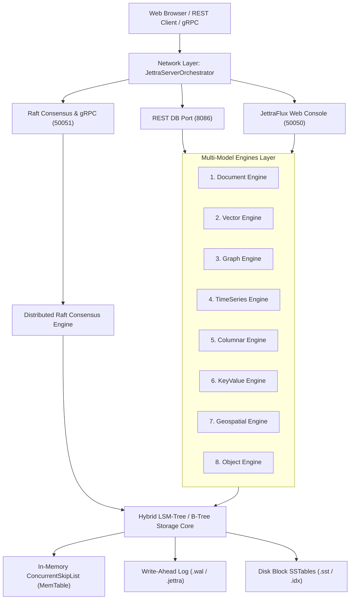
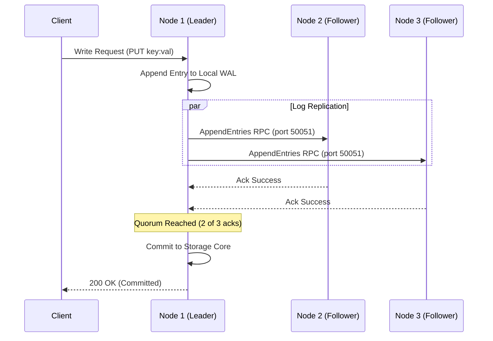

# JettraStoreEngine: The Definitive Architecture & Operations Book
**Autonomous Multi-Model Storage Engine with Raft Consensus, LSM-Tree / B-Tree Hybrid Storage, and High-Density Java 25 Virtual Architecture**

---

## Table of Contents

- [Chapter 1: Architecture, Core Concepts & JVM 25 Optimizations](#chapter-1-architecture-core-concepts--jvm-25-optimizations)
- [Chapter 2: Storage Engine Internals & Algorithms (LSM-Tree & B-Tree Hybrid)](#chapter-2-storage-engine-internals--algorithms-lsm-tree--b-tree-hybrid)
- [Chapter 3: Installation, Configuration & Property Reference](#chapter-3-installation-configuration--property-reference)
- [Chapter 4: Multi-Node Clustering & Distributed Raft Consensus](#chapter-4-multi-node-clustering--distributed-raft-consensus)
- [Chapter 5: Docker & Docker Compose Multi-Node Orchestration](#chapter-5-docker--docker-compose-multi-node-orchestration)
- [Chapter 6: The 8 Multi-Model Database Engines & REST APIs](#chapter-6-the-8-multi-model-database-engines--rest-apis)
  - [6.1 Document Engine (JSON / NoSQL)](#61-document-engine-json--nosql)
  - [6.2 Vector Engine (AI Embeddings & Cosine ANN)](#62-vector-engine-ai-embeddings--cosine-ann)
  - [6.3 Graph Engine (Vertices, Edges & Deep Traversal)](#63-graph-engine-vertices-edges--deep-traversal)
  - [6.4 TimeSeries Engine (IoT, Metrics & Aggregations)](#64-timeseries-engine-iot-metrics--aggregations)
  - [6.5 Columnar Engine (OLAP & Analytical Projections)](#65-columnar-engine-olap--analytical-projections)
  - [6.6 KeyValue Engine (Ultra-Low Latency Cache)](#66-keyvalue-engine-ultra-low-latency-cache)
  - [6.7 Geospatial Engine (2D Coordinates & Haversine Distance)](#67-geospatial-engine-2d-coordinates--haversine-distance)
  - [6.8 Object Engine (Binary BLOBs & Stream Blocks)](#68-object-engine-binary-blobs--stream-blocks)
- [Chapter 7: Aggregations Pipeline & Analytical Operations](#chapter-7-aggregations-pipeline--analytical-operations)
- [Chapter 8: Java Driver Patterns, Repositories & Fluent Query API](#chapter-8-java-driver-patterns-repositories--fluent-query-api)
- [Chapter 9: End-to-End Business Case: Multi-Model E-Invoicing System](#chapter-9-end-to-end-business-case-multi-model-e-invoicing-system)
- [Chapter 10: Security, Authentication & Per-Database RBAC](#chapter-10-security-authentication--per-database-rbac)
- [Chapter 11: Web Administration Console (JettraFlux GUI)](#chapter-11-web-administration-console-jettraflux-gui)
- [Chapter 12: Backups, Snapshot Replication & Disaster Recovery](#chapter-12-backups-snapshot-replication--disaster-recovery)
- [Appendix A: Keyset Pagination, Subqueries & Tombstones](#appendix-a-keyset-pagination-subqueries--tombstones)
- [Appendix B: JVM 25, Generational ZGC & Compact Object Headers Tuning](#appendix-b-jvm-25-generational-zgc--compact-object-headers-tuning)

---

# Chapter 1: Architecture, Core Concepts & JVM 25 Optimizations

`JettraStoreEngine` is a next-generation, cloud-native multi-model database engine designed from the ground up for high concurrency, zero-external-dependency operations, and sub-millisecond data access across diverse operational and analytical workloads.



### Key Architectural Pillars

1. **Autonomous & Self-Contained**: No external daemon (like Zookeeper, etcd, or external C libraries) is required. Everything runs inside a single, unified JVM runtime.
2. **Java 25 Native Performance**:
   - **Virtual Threads (Project Loom)**: Every inbound HTTP and gRPC request executes on lightweight virtual threads, scaling effortlessly to hundreds of thousands of concurrent connections.
   - **Compact Object Headers (JEP 450)**: Reduces 64-bit object header overhead from 96/128 bits down to 64 bits, cutting memory usage by 15%–25% and maximizing L1/L2 CPU cache density.
   - **Preview Primitive Class Records**: Zero-allocation value transformations for byte buffers and vector arithmetic.
3. **Multi-Model Native**: Rather than translating relational tables into JSON, 8 specialized engines execute natively on top of the same optimized storage blocks.

---

# Chapter 2: Storage Engine Internals & Algorithms (LSM-Tree & B-Tree Hybrid)

The storage subsystem in `JettraStoreEngine` combines the write throughput of **Log-Structured Merge Trees (LSM)** with the instant random-read latency of **B-Trees**.

### Write Pipeline (Append & Buffer)
1. **Write-Ahead Log (WAL)**: Every mutate operation (`PUT`, `DELETE`, `INSERT`) is first sequentially appended to disk in the WAL file (`*.wal`). Sequential I/O delivers millions of writes per second with zero disk seeking.
2. **MemTable**: Concurrently, the record is placed into an in-memory `ConcurrentSkipListMap` (the active MemTable).
3. **Flushing & SSTables**: When the active MemTable reaches the memory threshold (default 64MB), it is made immutable and background virtual threads flush it to disk as an immutable SSTable (`*.sst`) accompanied by a sparse B-Tree index (`*.idx`).

### Read Pipeline (Multi-Tier Lookup)
1. **MemTable Lookup**: Checked first in memory ($O(\log N)$).
2. **Bloom Filter Verification**: If not in memory, a per-SSTable Bloom filter validates presence in $O(1)$ to prevent unnecessary disk seeks.
3. **Sparse B-Tree Index**: Binary searches the block offset in the SSTable file.
4. **Direct Block Read**: Reads the exact compressed data chunk.

### LSM Compaction Service
As updates and deletions occur, background compaction threads merge multiple SSTable segments into consolidated B-Tree indexed files, purging obsolete versions and tombstones to maintain $O(\log N)$ lookup performance.

---

# Chapter 3: Installation, Configuration & Property Reference

### Prerequisites
- **JDK 25** (with `--enable-preview` flag enabled)
- **Maven 3.9+**
- Linux (Ubuntu, Debian, RHEL, Alpine) or macOS / Windows

### Building from Source
```bash
git clone https://github.com/avbravo/JettraStoreEngine.git
cd JettraStoreEngine
mvn clean install -DskipTests
```

### Configuration File: `jettrastoreengine.properties`
Place `jettrastoreengine.properties` in the root execution directory:

```properties
# ------------------------------------------------------------------------------
# Node Identification & Storage Root
# ------------------------------------------------------------------------------
jettra.node.id=node1
jettra.data.dir=~/data/node1

# ------------------------------------------------------------------------------
# Network Ports
# ------------------------------------------------------------------------------
# Database REST API Port
jettra.node.port=8086

# JettraFlux Web Management Console Port
jettra.gui.port=50050

# Consensus / gRPC Cluster Synchronization Port
jettra.grpc.port=50051

# ------------------------------------------------------------------------------
# Distributed Cluster & Consensus Peers
# ------------------------------------------------------------------------------
# Comma-separated list of host:port for Raft quorum
jettra.cluster.peers=127.0.0.1:50051,127.0.0.1:50053,127.0.0.1:50055

# ------------------------------------------------------------------------------
# Backup & Disaster Recovery
# ------------------------------------------------------------------------------
store.restore.auto=false
store.backup.enabled=true
store.backup.interval.minutes=1440
```

### Startup Console Banner
When starting `App.java`, the system prints a comprehensive property summary:

```text
==================================================================================
                   JETTRA STORE ENGINE - WEB CONSOLE ACTIVE                       
==================================================================================
  [Configured Properties (jettrastoreengine.properties)]:
  • Node ID (jettra.node.id):                 node1
  • Data Directory (jettra.data.dir):         ~/data/node1
  • REST Database Port (jettra.node.port):    8086
  • Web Management Port (jettra.gui.port):    50050
  • gRPC / Consensus Port (jettra.grpc.port): 50051
  • Cluster Peers (jettra.cluster.peers):     127.0.0.1:50051
  • Auto-Restore (store.restore.auto):        false
  • Auto-Backup (store.backup.enabled):       true (Interval: 1440 min)
  --------------------------------------------------------------------------------
  [Web Management & Console URLs]:
  • Web Management UI (GUI):                  http://localhost:50050/ (or /dashboard)
  • Multi-Model Database Engines:             http://localhost:50050/engines
  • Users & Security (Per-Database RBAC):     http://localhost:50050/users
  • Cluster Topology & Internals:             http://localhost:50050/components
  • Swagger OpenAPI Explorer:                 http://localhost:50050/swagger-ui
  --------------------------------------------------------------------------------
  [REST Database APIs]:
  • REST Universal Multi-Model API:           http://localhost:8086/api/model/
  • REST Document Engine API:                 http://localhost:8086/api/document/
  • Default Admin Credentials:                admin / admin  (or super-user / superUserZ)
==================================================================================
```

---

# Chapter 4: Multi-Node Clustering & Distributed Raft Consensus

`JettraStoreEngine` implements an embedded **Raft Consensus Protocol** for automated leader election, continuous state replication, and split-brain tolerance.



## 4.1 Multi-Node Cluster Installation & Execution from JAR Files

You can execute a multi-node cluster either on a **single local host** (using distinct port numbers and storage directories) or across **multiple physical / virtual servers** in a network.

### Scenario A: Local 3-Node Cluster on Single Machine

#### 1. Directory Structure Setup
Create isolated working directories for each node:
```bash
mkdir -p cluster/node1 cluster/node2 cluster/node3
cp target/JettraStoreEngine-1.0-SNAPSHOT.jar cluster/node1/
cp target/JettraStoreEngine-1.0-SNAPSHOT.jar cluster/node2/
cp target/JettraStoreEngine-1.0-SNAPSHOT.jar cluster/node3/
```

#### 2. Configuration Files

##### `cluster/node1/jettrastoreengine.properties`
```properties
jettra.node.id=node1
jettra.data.dir=./data
jettra.node.port=8086
jettra.gui.port=50050
jettra.grpc.port=50051
jettra.cluster.peers=127.0.0.1:50051,127.0.0.1:50053,127.0.0.1:50055
store.restore.auto=false
store.backup.enabled=false
```

##### `cluster/node2/jettrastoreengine.properties`
```properties
jettra.node.id=node2
jettra.data.dir=./data
jettra.node.port=8087
jettra.gui.port=50052
jettra.grpc.port=50053
jettra.cluster.peers=127.0.0.1:50051,127.0.0.1:50053,127.0.0.1:50055
store.restore.auto=false
store.backup.enabled=false
```

##### `cluster/node3/jettrastoreengine.properties`
```properties
jettra.node.id=node3
jettra.data.dir=./data
jettra.node.port=8088
jettra.gui.port=50054
jettra.grpc.port=50055
jettra.cluster.peers=127.0.0.1:50051,127.0.0.1:50053,127.0.0.1:50055
store.restore.auto=false
store.backup.enabled=false
```

#### 3. Execution Script (`start-cluster.sh`)
Create `cluster/start-cluster.sh`:
```bash
#!/usr/bin/env bash
echo "Starting JettraStoreEngine 3-Node Cluster..."

cd node1 && java --enable-preview -jar JettraStoreEngine-1.0-SNAPSHOT.jar > node1.log 2>&1 &
echo "Node 1 started on REST:8086, GUI:50050, Raft:50051 (PID: $!)"
cd ..

cd node2 && java --enable-preview -jar JettraStoreEngine-1.0-SNAPSHOT.jar > node2.log 2>&1 &
echo "Node 2 started on REST:8087, GUI:50052, Raft:50053 (PID: $!)"
cd ..

cd node3 && java --enable-preview -jar JettraStoreEngine-1.0-SNAPSHOT.jar > node3.log 2>&1 &
echo "Node 3 started on REST:8088, GUI:50054, Raft:50055 (PID: $!)"
cd ..

echo "Cluster startup complete! Access GUIs at:"
echo " - Node 1 GUI: http://localhost:50050/"
echo " - Node 2 GUI: http://localhost:50052/"
echo " - Node 3 GUI: http://localhost:50054/"
```

#### 4. Shutdown Script (`stop-cluster.sh`)
```bash
#!/usr/bin/env bash
echo "Stopping JettraStoreEngine Cluster..."
fuser -k 50051/tcp 50053/tcp 50055/tcp 8086/tcp 8087/tcp 8088/tcp 50050/tcp 50052/tcp 50054/tcp || true
echo "All nodes stopped."
```

---

### Scenario B: Multi-Node Cluster on Distinct Physical / Virtual Machines

When deploying on 3 separate servers with IPs `192.168.1.10`, `192.168.1.11`, `192.168.1.12`:

1. **Deploy the JAR on each server**:
   ```bash
   scp target/JettraStoreEngine-1.0-SNAPSHOT.jar user@192.168.1.10:/opt/jettra/
   scp target/JettraStoreEngine-1.0-SNAPSHOT.jar user@192.168.1.11:/opt/jettra/
   scp target/JettraStoreEngine-1.0-SNAPSHOT.jar user@192.168.1.12:/opt/jettra/
   ```

2. **Configure `/opt/jettra/jettrastoreengine.properties` on each machine**:
   - **Server 1 (`192.168.1.10`)**:
     ```properties
     jettra.node.id=node1
     jettra.data.dir=/var/lib/jettra/data
     jettra.node.port=8086
     jettra.gui.port=50050
     jettra.grpc.port=50051
     jettra.cluster.peers=192.168.1.10:50051,192.168.1.11:50051,192.168.1.12:50051
     ```
   - **Server 2 (`192.168.1.11`)**:
     ```properties
     jettra.node.id=node2
     jettra.data.dir=/var/lib/jettra/data
     jettra.node.port=8086
     jettra.gui.port=50050
     jettra.grpc.port=50051
     jettra.cluster.peers=192.168.1.10:50051,192.168.1.11:50051,192.168.1.12:50051
     ```
   - **Server 3 (`192.168.1.12`)**:
     ```properties
     jettra.node.id=node3
     jettra.data.dir=/var/lib/jettra/data
     jettra.node.port=8086
     jettra.gui.port=50050
     jettra.grpc.port=50051
     jettra.cluster.peers=192.168.1.10:50051,192.168.1.11:50051,192.168.1.12:50051
     ```

3. **Run on each server as a Systemd Service or Direct Process**:
   ```bash
   java --enable-preview -jar /opt/jettra/JettraStoreEngine-1.0-SNAPSHOT.jar
   ```

---

# Chapter 5: Docker & Docker Compose Multi-Node Orchestration

### 1. High-Density Container `Dockerfile` (Liberica JRE 25 Musl)

Using the official lightweight `bellsoft/liberica-runtime-container:jre-25-stream-musl` image for optimal memory footprint, Alpine/Musl compatibility, and Java 25 Compact Object Headers support:

```dockerfile
FROM bellsoft/liberica-runtime-container:jre-25-stream-musl
WORKDIR /opt/jettra

# Copy pre-built shaded jar
COPY target/JettraStoreEngine-1.0-SNAPSHOT.jar app.jar

# REST API (8086), GUI Console (50050), Raft Consensus (50051)
EXPOSE 8086 50050 50051

ENTRYPOINT ["java", "--enable-preview", "-jar", "app.jar"]
```

### 2. 3-Node Cluster `docker-compose.yml`

Create `docker-compose.yml` in the project root:

```yaml
version: '3.8'

networks:
  jettra-net:
    driver: bridge

volumes:
  node1-data:
  node2-data:
  node3-data:

services:
  jettra-node1:
    image: jettra/store-engine:latest
    build:
      context: .
      dockerfile: Dockerfile
    container_name: jettra-node1
    environment:
      - JETTRA_NODE_ID=node1
      - JETTRA_DATA_DIR=/data/node1
      - JETTRA_DB_PORT=8086
      - JETTRA_GUI_PORT=50050
      - JETTRA_GRPC_PORT=50051
      - JETTRA_CLUSTER_PEERS=jettra-node1:50051,jettra-node2:50051,jettra-node3:50051
    ports:
      - "8086:8086"    # REST API Node 1
      - "50050:50050"  # GUI Web Console Node 1
      - "50051:50051"  # Raft Consensus Node 1
    volumes:
      - node1-data:/data/node1
    networks:
      - jettra-net
    restart: unless-stopped

  jettra-node2:
    image: jettra/store-engine:latest
    build:
      context: .
      dockerfile: Dockerfile
    container_name: jettra-node2
    environment:
      - JETTRA_NODE_ID=node2
      - JETTRA_DATA_DIR=/data/node2
      - JETTRA_DB_PORT=8086
      - JETTRA_GUI_PORT=50050
      - JETTRA_GRPC_PORT=50051
      - JETTRA_CLUSTER_PEERS=jettra-node1:50051,jettra-node2:50051,jettra-node3:50051
    ports:
      - "8087:8086"    # REST API Node 2
      - "50052:50050"  # GUI Web Console Node 2
      - "50053:50051"  # Raft Consensus Node 2
    volumes:
      - node2-data:/data/node2
    networks:
      - jettra-net
    restart: unless-stopped

  jettra-node3:
    image: jettra/store-engine:latest
    build:
      context: .
      dockerfile: Dockerfile
    container_name: jettra-node3
    environment:
      - JETTRA_NODE_ID=node3
      - JETTRA_DATA_DIR=/data/node3
      - JETTRA_DB_PORT=8086
      - JETTRA_GUI_PORT=50050
      - JETTRA_GRPC_PORT=50051
      - JETTRA_CLUSTER_PEERS=jettra-node1:50051,jettra-node2:50051,jettra-node3:50051
    ports:
      - "8088:8086"    # REST API Node 3
      - "50054:50050"  # GUI Web Console Node 3
      - "50055:50051"  # Raft Consensus Node 3
    volumes:
      - node3-data:/data/node3
    networks:
      - jettra-net
    restart: unless-stopped
```

### 3. Cluster Commands with Docker Compose

```bash
# 1. Build and package the project JAR first
mvn clean package -DskipTests

# 2. Build and launch the 3-node cluster in the background
docker compose up -d --build

# 3. View live cluster logs across all 3 nodes
docker compose logs -f

# 4. Check cluster status
docker compose ps

# 5. Stop cluster and preserve volumes
docker compose down

# 6. Stop cluster and reset data volumes
docker compose down -v
```

---

# Chapter 6: The 8 Multi-Model Database Engines & REST APIs

`JettraStoreEngine` hosts 8 purpose-built database engines over a shared, high-throughput storage engine.

---

## 6.1 Document Engine (JSON / NoSQL)
- **Use Case**: Hierarchical JSON records, schema-flexible document catalogs, and e-commerce models.
- **REST Endpoints**:
  - `POST /api/document/{collection}/{id}` : Insert or update document.
  - `GET  /api/document/{collection}/{id}` : Read document by ID.
  - `DELETE /api/document/{collection}/{id}` : Delete document.

```bash
# Insert a customer document
curl -X POST http://localhost:8086/api/document/customers/cust_101 \
  -H "Content-Type: application/json" \
  -d '{"name": "Alice Corp", "tier": "Enterprise", "credits": 5000}'
```

---

## 6.2 Vector Engine (AI Embeddings & Cosine ANN)
- **Use Case**: Semantic search, LLM Retrieval-Augmented Generation (RAG), and recommendation embeddings.
- **Data Model**: `float[]` high-dimensional vector embeddings with metadata.
- **REST Endpoints**:
  - `POST /api/model/vector/insert` : Insert embedding with metadata payload.
  - `POST /api/model/vector/search` : Top-K Approximate Nearest Neighbor (ANN) by Cosine similarity.

```bash
# Insert a 4-dimensional vector embedding
curl -X POST http://localhost:8086/api/model/vector/insert \
  -H "Content-Type: application/json" \
  -d '{
    "collection": "kb_articles",
    "id": "vec_99",
    "vector": [0.12, 0.45, 0.88, 0.31],
    "metadata": {"title": "LSM Compaction Guide", "author": "Jettra Team"}
  }'
```

---

## 6.3 Graph Engine (Vertices, Edges & Deep Traversal)
- **Use Case**: Social networks, fraud detection, dependency graphs, and knowledge graphs.
- **Data Model**: Property Graph with Vertices and Directed/Undirected Edges.
- **REST Endpoints**:
  - `POST /api/model/graph/node` : Create or update vertex.
  - `POST /api/model/graph/edge` : Create relation with weight and properties.
  - `GET  /api/model/graph/node?graph={graph}&id={id}` : Fetch node with adjacency list.

```bash
# Create graph node
curl -X POST http://localhost:8086/api/model/graph/node \
  -H "Content-Type: application/json" \
  -d '{"graph": "social_net", "id": "user_1", "data": {"name": "Bob", "role": "Engineer"}}'
```

---

## 6.4 TimeSeries Engine (IoT, Metrics & Aggregations)
- **Use Case**: Server telemetry, IoT sensor feeds, financial tick-by-tick logs.
- **Data Model**: Time-stamped metrics with indexed dimension tags.
- **REST Endpoints**:
  - `POST /api/model/timeseries/insert` : Ingest time point.
  - `GET  /api/model/timeseries/range` : Query range $[T_{start}, T_{end}]$.

```bash
# Ingest IoT temperature sensor data
curl -X POST http://localhost:8086/api/model/timeseries/insert \
  -H "Content-Type: application/json" \
  -d '{
    "metric": "rack_temp",
    "timestamp": 1724180000000,
    "data": {"temp_c": 24.5, "humidity_pct": 45, "sensor_id": "sn_01"}
  }'
```

---

## 6.5 Columnar Engine (OLAP & Analytical Projections)
- **Use Case**: Data warehousing, columnar aggregations, and business intelligence.
- **Data Model**: Column families stored in contiguous columnar arrays.
- **REST Endpoints**:
  - `POST /api/model/column/row` : Insert row vector.
  - `GET  /api/model/column/row?table={tbl}&key={k}` : Read row by key.

---

## 6.6 KeyValue Engine (Ultra-Low Latency Cache)
- **Use Case**: User session storage, token caching, feature flags.
- **REST Endpoints**:
  - `POST /api/model/keyvalue/set` : Put key/value.
  - `GET  /api/model/keyvalue/get?namespace={ns}&key={k}` : Get value.

---

## 6.7 Geospatial Engine (2D Coordinates & Haversine Distance)
- **Use Case**: Delivery tracking, geo-fencing, distance radius calculations.
- **REST Endpoints**:
  - `POST /api/model/geospatial/insert` : Register lat/lon point.
  - `GET  /api/model/geospatial/point?layer={layer}&id={id}` : Retrieve geo point.

---

## 6.8 Object Engine (Binary BLOBs & Stream Blocks)
- **Use Case**: File storage, image assets, serialized model weights.
- **REST Endpoints**:
  - `POST /api/model/object/save` : Store binary/JSON payload.
  - `GET  /api/model/object/get?bucket={b}&id={id}` : Retrieve object.

---

# Chapter 7: Aggregations Pipeline & Analytical Operations

`JettraStoreEngine` supports multi-stage aggregation pipelines across collections and columnar families.

### Summary of Aggregation Operators

| Operator | Purpose | Example |
| :--- | :--- | :--- |
| **`$match`** | Filters documents based on query criteria. | `{"$match": {"status": "ACTIVE"}}` |
| **`$group`** | Groups documents by a key and executes accumulators. | `{"$group": {"_id": "$category", "total": {"$sum": "$price"}}}` |
| **`$sum`** | Computes the arithmetic sum of numeric values. | `{"$sum": "$order_total"}` |
| **`$avg`** | Computes the statistical average of a field. | `{"$avg": "$response_time_ms"}` |
| **`$min` / `$max`** | Identifies extreme bounds in a dataset. | `{"$min": "$latency"}`, `{"$max": "$latency"}` |
| **`$count`** | Returns the count of documents matching the pipeline stage. | `{"$count": "active_users"}` |

### REST Aggregation Pipeline
`POST /api/document/{collection}/aggregate`

```json
[
  {
    "$match": { "category": "electronics" }
  },
  {
    "$group": {
      "_id": "$brand",
      "totalInventory": { "$sum": "$stock" },
      "avgPrice": { "$avg": "$price" }
    }
  }
]
```

---

# Chapter 8: Java Driver Patterns, Repositories & Fluent Query API

### 8.1 Typed Repository Pattern
Define your data models cleanly as immutable **Java Records**:

```java
import com.jettra.driver.java.JettraRepository;
import java.util.Optional;

public record Planet(String id, String name, double mass, boolean hasRings) {}

public class RepositoryDemo {
    public static void main(String[] args) {
        JettraClient client = new JettraClient("127.0.0.1", 8086);
        client.connect();
        
        JettraRepository<Planet> planetRepo = client.repository(Planet.class, "DOCUMENT", "planets");
        
        // Save Record
        Planet mars = new Planet("p_001", "Mars", 0.107, false);
        planetRepo.save(mars.id(), mars);
        
        // Read Record
        Optional<Planet> retrieved = planetRepo.findById("p_001");
        retrieved.ifPresent(p -> System.out.println("Found planet: " + p.name()));
    }
}
```

### 8.2 Repository Pattern with Interfaces

```java
public interface UserRepository {
    void save(User user);
    Optional<User> findById(String id);
    List<User> findByActive(boolean active);
}

public class UserRepositoryImpl implements UserRepository {
    private final JettraRepository<User> repo;
    
    public UserRepositoryImpl(JettraClient client) {
        this.repo = client.repository(User.class, "DOCUMENT", "users");
    }
    
    @Override
    public void save(User user) { repo.save(user.id(), user); }
    
    @Override
    public Optional<User> findById(String id) { return repo.findById(id); }
    
    @Override
    public List<User> findByActive(boolean active) {
        return repo.query("{active: " + active + "}");
    }
}
```

---

# Chapter 9: End-to-End Business Case: Multi-Model E-Invoicing System

This chapter demonstrates how an entire enterprise billing and electronic invoicing system leverages **all 8 engines natively** in `JettraStoreEngine`.

### 9.1 Domain Model Definition (Java Records)

```java
import java.time.LocalDate;
import java.util.List;

public enum TipoIdentificacion { CEDULA, NIT, PASAPORTE, RUC }
public enum EstadoFactura { BORRADOR, EMITIDA, PAGADA, ANULADA }
public enum MetodoPago { EFECTIVO, TARJETA_CREDITO, TRANSFERENCIA, CREDITO }

public record Direccion(String calle, String ciudad, String pais) {}

public record Contribuyente(
    String id,
    TipoIdentificacion tipoId,
    String nombreLegal,
    String email,
    Direccion direccion
) {}

public record ImpuestoCategoria(String codigo, String nombre, double porcentaje) {}

public record Producto(
    String sku,
    String nombre,
    double precioUnitario,
    ImpuestoCategoria impuesto
) {}

public record LineaFactura(
    int numeroLinea,
    Producto producto,
    double cantidad,
    double porcentajeDescuento
) {
    public double subtotalNeto() { return (producto.precioUnitario() * cantidad) * (1.0 - porcentajeDescuento / 100.0); }
    public double montoImpuesto() { return subtotalNeto() * (producto.impuesto().porcentaje() / 100.0); }
    public double totalLinea() { return subtotalNeto() + montoImpuesto(); }
}

public record TotalesFactura(double totalNeto, double totalImpuestos, double granTotal) {}

public record Factura(
    String numeroFactura,
    String claveAcceso,
    LocalDate fechaEmision,
    Contribuyente emisor,
    Contribuyente receptor,
    List<LineaFactura> lineas,
    MetodoPago metodoPago,
    EstadoFactura estado
) {}
```

### 9.2 Polyglot Architecture Mapping

| Component | Storage Engine | Purpose |
| :--- | :--- | :--- |
| **Facturas & Contribuyentes** | `DOCUMENT` | Full hierarchical JSON invoice persistence with schema validation. |
| **Búsqueda Semántica de Ítems** | `VECTOR` | 1536d embeddings for product discovery and automated catalog grouping. |
| **Red de Clientes & Proveedores** | `GRAPH` | Social knowledge graph for supply chain fraud detection and relationships. |
| **Métricas de Facturación** | `TIMESERIES` | High-frequency telemetry of invoice issuance per second/minute. |
| **Reportes Fiscales Mensuales** | `COLUMN` | Columnar OLAP aggregations for tax declarations (`SUM`, `AVG`). |
| **Sesiones & Locks de Factura** | `KEYVALUE` | Ultra-low latency memory locks during invoice electronic signing. |
| **Geolocalización de Entregas** | `GEOSPATIAL` | GPS delivery validation and tax jurisdiction mapping. |
| **XML Firmado & PDFs (BLOBs)** | `OBJECT` | Secure, chunked block storage for cryptographic XML files and PDF receipts. |

---

# Chapter 10: Security, Authentication & Per-Database RBAC

### Per-Database Access Control Architecture
`JettraStoreEngine` enforces Role-Based Access Control (RBAC) scoped at the individual database and engine level:

| Role Name | Scope | Permissions |
| :--- | :--- | :--- |
| **`DB_ADMIN`** | Database-Specific / Global | Full DDL & DML: Create/Drop collections, index definitions, and write data. |
| **`READ_WRITE`** | Database-Specific | DML Operations: Insert, update, query, and delete records. |
| **`READ_ONLY`** | Database-Specific | Query & Scan: Read-only access for analysts and reporting tools. |
| **`MANAGER`** | Global / Node | Operational: Trigger WAL snapshots, cluster health, and backups. |

### JWT Token Generation
Authenticate via `POST /api/auth/login` to obtain an HMAC-SHA256 bearer token:
```bash
curl -X POST http://localhost:8086/api/auth/login \
  -H "Content-Type: application/x-www-form-urlencoded" \
  -d "username=admin&password=admin"
```

---

# Chapter 11: Web Administration Console (JettraFlux GUI)

The Web Console runs on `jettra.gui.port` (default `50050`) built entirely with **JettraFlux**:

### Available Web Routes
1. **`/login`**: Secure authentication view with credential hints.
2. **`/dashboard`** (or `/`): Real-time JVM heap metrics, CPU, disk usage, active engine cards, and backup trigger.
3. **`/engines`**: Interactive database and object creation console for all 8 multi-model engines with live result previews.
4. **`/users`**: Per-database user provisioning, role assignments, credential management, and JWT token policy viewer.
5. **`/components`**: LSM-Tree/B-Tree engine internals, active `.jettra` disk file listing, and Raft consensus status.
6. **`/swagger-ui`**: Interactive OpenAPI explorer for testing all REST endpoints directly in the browser.

---

# Chapter 12: Backups, Snapshot Replication & Disaster Recovery

### Manual Backup via REST API
```bash
curl -X POST http://localhost:8086/api/backup
```

### Auto-Restore on Node Boot
Enable automatic disaster recovery in `jettrastoreengine.properties`:
```properties
store.restore.auto=true
```
When enabled, `BackupManager` scans the storage root on boot, extracts the latest timestamped `.zip` snapshot archive, and restores all `.wal`, `.sst`, and `.jettra` files seamlessly before starting network listeners.

---

# Appendix A: Keyset Pagination, Subqueries & Tombstones

### 1. High-Performance Keyset Pagination
Never use legacy `OFFSET` for large datasets. Use index-assisted keyset pagination ($O(\log N)$):
```sql
FIND IN invoices WHERE status = 'EMITIDA' AFTER id 'INV_2026_09999' LIMIT 50;
```

### 2. Deletions via Tombstones
Deletes append an immutable Tombstone marker to the WAL and MemTable. The SSTable compaction process eventually sweeps away dead disk records during background merging.

---

# Appendix B: JVM 25, Generational ZGC & Compact Object Headers Tuning

### Production JVM Launch Flags
For maximum throughput and deterministic sub-millisecond GC pauses:

```bash
java --enable-preview \
  -XX:+UseZGC \
  -XX:+ZGenerational \
  -XX:+UnlockExperimentalVMOptions \
  -XX:+UseCompactObjectHeaders \
  -Xms4g -Xmx16g \
  -jar JettraStoreEngine-1.0-SNAPSHOT.jar
```
