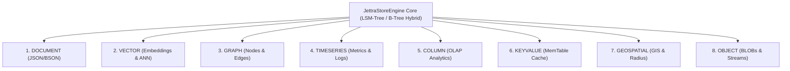

# Panel de Administración Web con JettraFlux (`JettraStoreEngine`)

Este documento describe la arquitectura, características y guía de uso de la nueva interfaz web de administración de **JettraStoreEngine**, desarrollada íntegramente sobre el framework de componentes nativo **JettraFlux** (reemplazando la antigua librería `JettraWUI`).

---

## 1. Arquitectura y Migración a JettraFlux

`JettraStoreEngine` incorpora una consola web moderna y responsiva construida con componentes reactivos de **JettraFlux**, optimizada para ejecutarse en Java 25 con Virtual Threads (Project Loom) y Compact Object Headers (JEP 450).

### Principales Mejoras frente a JettraWUI:
- **Componentes Nativos JettraFlux**: Uso de widgets modulares (`Scaffold`, `Left`, `Top`, `Card`, `StatCard`, `Datatable`, `ThemeChanged`, `Avatar`, `OverlayMenu`, `NotificationTop`).
- **Diseño Estético y Modo Oscuro**: Paleta de colores armoniosa, tarjetas 3D con desenfoque de fondo (*glassmorphism*), tipografía moderna e iconos vectoriales integrados.
- **Soporte Dinámico de Temas**: Selector de tema en tiempo real mediante el componente `ThemeChanged`.
- **Inspección Multi-Modelo**: Panel dedicado para los 8 motores de base de datos soportados.

---

## 2. Configuración de Puertos y Acceso

En el archivo `jettrastoreengine.properties` se configuran los puertos de escucha:

```properties
jettra.node.id=node1
jettra.data.dir=~/data/node1
jettra.node.port=8086
jettra.gui.port=50050
jettra.grpc.port=50051
jettra.cluster.peers=192.168.1.100:50051,192.168.1.101:50051,192.168.1.102:50051
```

- **`jettra.gui.port`** (Por defecto `50050`): Puerto exclusivo donde escucha la **Interfaz Web de Administración (JettraFlux GUI)**.
- **`jettra.node.port`** (Por defecto `8086` o `8080`): Puerto de la **API REST del motor de base de datos** (`/api/...`).
- **`jettra.grpc.port`** (Por defecto `50051`): Puerto de replicación cluster gRPC / Raft Consensus.

Al iniciar `JettraStoreEngine`, el servidor imprime en la consola del shell el banner informativo con todos los enlaces directos:

```text
==================================================================================
                   JETTRA STORE ENGINE - WEB CONSOLE ACTIVE                       
==================================================================================
  Web Management UI (GUI): http://localhost:50050/ (or /dashboard, /wui)
  Multi-Model Engines:     http://localhost:50050/engines
  Users & Security:        http://localhost:50050/users
  Cluster & Internals:     http://localhost:50050/components
  Swagger OpenAPI:         http://localhost:50050/swagger-ui
  --------------------------------------------------------------------------------
  REST Database API:       http://localhost:8086/api/
  REST Multi-Model API:    http://localhost:8086/api/model/
  REST Document API:       http://localhost:8086/api/document/
  gRPC Cluster Port:       50051
  Default Credentials:     admin / admin  (or super-user / superUserZ)
==================================================================================
```

| Ruta Web (GUI) | Descripción |
| :--- | :--- |
| `http://localhost:50050/` o `/dashboard` / `/wui` | **Panel Principal (Dashboard)**: Métricas del sistema en tiempo real, resumen de los 8 motores y copias de seguridad. |
| `http://localhost:50050/engines` | **Explorador Multi-Modelo**: Navegación e inspección técnica de cada uno de los 8 motores de datos. |
| `http://localhost:50050/users` | **Seguridad y Usuarios**: Administración de usuarios, credenciales, roles RBAC y políticas JWT. |
| `http://localhost:50050/components` | **Componentes e Internos**: Estado del motor híbrido LSM/B-Tree, cluster Raft y archivos de almacenamiento `.jettra`. |
| `http://localhost:50050/login` | **Autenticación**: Inicio de sesión interactivo con control de sesión. |
| `http://localhost:50050/swagger-ui` | **OpenAPI Swagger UI**: Explorador interactivo de todas las APIs REST del motor. |

---

## 3. Credenciales de Acceso por Defecto

Para acceder a la consola web o invocar las APIs protegidas:

- **Usuario Administrador**: `admin` / `admin` (Asignado al rol `ADMIN` en `JettraSecurityDB`).
- **Super-Usuario del Engine**: `super-user` / `superUserZ` (Configurado en `AuthManager`).

---

## 4. Los 8 Motores Multi-Modelo Soportados

La consola web permite monitorear y gestionar los 8 motores de base de datos integrados en el núcleo de `JettraStoreEngine`:



### Detalle de cada Motor:

### 1. Motor de Documentos (`DOCUMENT`)
- **Propósito**: Almacenamiento NoSQL de documentos JSON/BSON con validación declarativa mediante anotaciones de `JettraRules`.
- **Rutas REST**:
  - `GET /api/document/{collection}/{id}` (Lectura de documento)
  - `POST /api/document/{collection}/{id}` (Inserción/Actualización replicada vía Raft)

### 2. Motor de Vectores (`VECTOR`)
- **Propósito**: Almacenamiento de embeddings vectoriales de alta dimensión para inteligencia artificial, búsqueda semántica y cálculo de distancia de similitud de coseno y búsqueda KNN.
- **Rutas REST**:
  - `POST /api/model/vector/insert`
  - `GET /api/model/vector/query`

### 3. Motor de Grafos (`GRAPH`)
- **Propósito**: Almacenamiento de grafos de propiedades con nodos (vértices) y aristas (relaciones dirigidas/no dirigidas), con algoritmos de recorrido en profundidad (DFS) y amplitud (BFS).
- **Rutas REST**:
  - `POST /api/model/graph/edge`
  - `GET /api/model/graph/traverse`

### 4. Motor de Series Temporales (`TIMESERIES`)
- **Propósito**: Ingesta masiva de métricas cronológicas, telemetría IoT y registros de auditoría ordenados por marca de tiempo con funciones de agregación temporal (`AVG`, `MIN`, `MAX`, `SUM`).
- **Rutas REST**:
  - `POST /api/model/timeseries/point`
  - `GET /api/model/timeseries/range`

### 5. Motor Columnar (`COLUMN`)
- **Propósito**: Almacenamiento analítico orientado a columnas (OLAP) optimizado para agregaciones sobre grandes volúmenes de datos con compresión vectorial.
- **Rutas REST**:
  - `POST /api/model/column/row`
  - `GET /api/model/column/scan`

### 6. Motor Clave-Valor (`KEYVALUE`)
- **Propósito**: Acceso ultrarrápido por clave primaria respaldado en memoria por una `MemTable` y un registro Write-Ahead Log (WAL).
- **Rutas REST**:
  - `POST /api/model/keyvalue/put`
  - `GET /api/model/keyvalue/get?key={clave}`

### 7. Motor Geoespacial (`GEOSPATIAL`)
- **Propósito**: Indexación de coordenadas 2D (latitud y longitud), consultas de proximidad radial (Haversine) y filtros de contención espacial.
- **Rutas REST**:
  - `POST /api/model/geospatial/point`
  - `GET /api/model/geospatial/radius?lat={lat}&lon={lon}&radiusKm={km}`

### 8. Motor de Objetos (`OBJECT`)
- **Propósito**: Persistencia de objetos binarios grandes (BLOBs), flujos serializados y fragmentación de archivos con verificación de integridad.
- **Rutas REST**:
  - `POST /api/model/object/put`
  - `GET /api/model/object/get?key={clave}`

---

## 5. Panel de Control y Monitoreo del Sistema

En la ruta `/dashboard`, la consola muestra:

1. **Métricas de Rendimiento**:
   - **Memoria JVM**: Uso de Heap RAM actual vs. Máximo disponible vía `ManagementFactory.getMemoryMXBean()`.
   - **Almacenamiento en Disco**: Espacio total, libre y utilizado en la carpeta de datos configurada (`jettra.data.dir`).
   - **Tiempo de Actividad (Uptime)**: Contador activo de horas, minutos y segundos.
   - **Estado del Cluster Raft**: Rol del nodo (Leader/Follower), puerto de replicación (`9092`) y estado de quórum.

2. **Acciones Operacionales**:
   - **Crear Instantánea de Respaldo**: Botón de disparo manual que invoca `POST /api/backup` generando un archivo ZIP con la copia exacta del WAL y los archivos `.jettra`.
   - **Explorador Rápido**: Enlace directo a cada motor para inspeccionar el esquema de datos y ejemplos en tiempo real.

---

## 6. Administración de Usuarios y Seguridad RBAC

En la ruta `/users`, los administradores pueden:
- Consultar la lista completa de usuarios registrados en `JettraSecurityDB`.
- Visualizar roles asignados (`ADMIN`, `MANAGER`, `DEMO`), UUID del usuario y estado de la cuenta (`ACTIVE` / `DISABLED`).
- Revisar las políticas de seguridad de tokens JWT (algoritmo HMAC-SHA256, expiración configurada y hashing de contraseñas con sal).
- Acceder directamente a la consola de administración de base de datos de seguridad en `/securitydb/admin`.

---

## 7. Componentes e Internos del Motor

En la ruta `/components`, la interfaz expone:
- **Estructura del Almacenamiento Híbrido**: Cantidad de archivos `.jettra` persistidos en disco y tamaño total.
- **Optimizaciones Java 25**: Detección y confirmación de Compact Object Headers (JEP 450) y Virtual Threads (Project Loom).
- **Consenso Raft**: Parámetros de replicación multi-nodo y puertos de sincronización.
